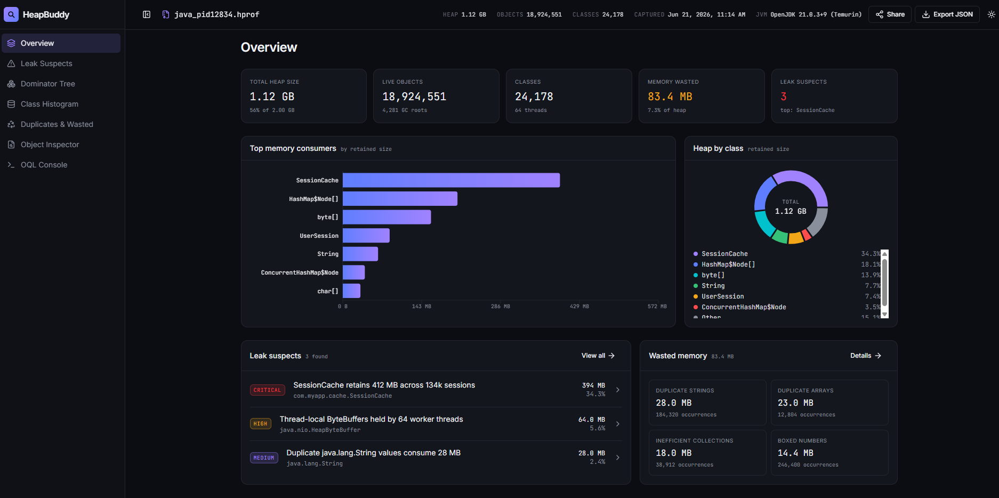
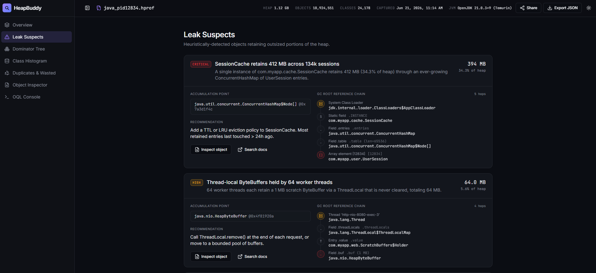
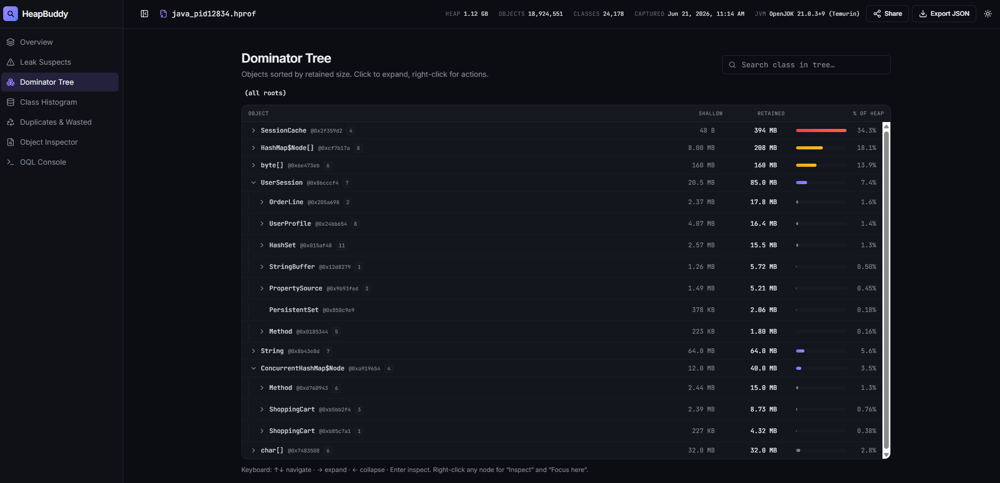
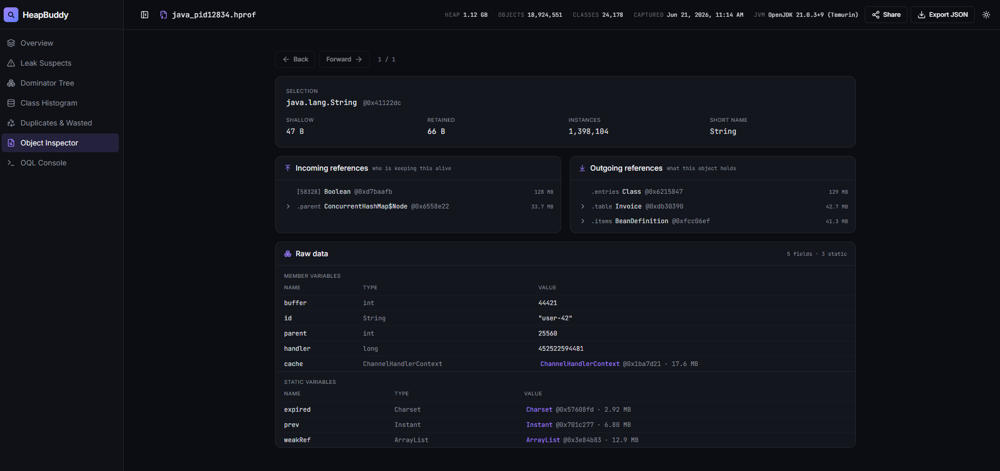

<div align="center">

# HeapBuddy

**Open-source, self-hostable Java/Android heap dump (`.hprof`) analyzer.**

Parse binary heap dumps locally and explore an interactive web report — leak
suspects with GC-root chains, a true dominator tree with retained sizes, an
object inspector, an OQL console, a class histogram, and wasted-memory analysis.
Ships as a single binary, a Docker image, and a CLI.

[](https://github.com/sachin-handiekar/heapbuddy/actions/workflows/go.yml)
[](https://github.com/sachin-handiekar/heapbuddy/releases)
[](https://github.com/sachin-handiekar/heapbuddy/pkgs/container/heapbuddy)
[](https://go.dev)
[](LICENSE)

</div>

> **Local-first & private:** dumps are processed entirely on your machine. No
> third-party calls, no telemetry, no database, no auth — designed for trusted,
> on-prem use.

---

## Quick start

Run the latest published image — no clone, no build:

```bash
docker run --rm -p 8080:8080 ghcr.io/sachin-handiekar/heapbuddy:latest
```

Then open **http://localhost:8080** and drop in a `.hprof` file. Prefer a binary
or building from source? See [Getting started](#getting-started).

---

## What you get

The web report has seven sections, all backed by real analysis of your dump:

| Section | What it shows |
|---|---|
| **Overview** | Heap size, live objects, classes, GC roots, wasted memory, leak-suspect count, top consumers, and a class breakdown |
| **Leak Suspects** | Classes retaining an outsized share of the heap, each with a GC-root reference chain and an accumulation point |
| **Dominator Tree** | Objects ranked by **true retained size** (what would be freed if collected), lazily expandable, with per-node share of heap |
| **Class Histogram** | Per-class instance counts, shallow size, and class-aggregated retained size |
| **Object Inspector** | Drill into a class/instance: its object fields plus incoming ("who keeps this alive") and outgoing references, navigable |
| **Duplicates & Wasted** | Duplicate strings, inefficient collections, boxed primitives, duplicate arrays |
| **OQL Console** | Query the heap with a SQL-like language (see [OQL](#oql)) |

The **Dominator Tree** and **OQL Console** are **opt-in** — enable them with
`--enable-advanced-analysis`. By default HeapBuddy does a fast, lean pass and
builds the heavier object-graph structures only on demand; see
[Advanced analysis](#advanced-analysis-dominator-tree--oql).

Under the hood these are powered by an HPROF parser, a compact reverse-reference
graph, and a Lengauer–Tarjan dominator tree computed from the object graph and GC
roots. The graph and dominator tree are built lazily, only when a view that needs
them is opened.

---

## Screenshots

<table>
  <tr>
    <td align="center" width="50%">
      <br/>
      <sub><b>Overview</b> — heap summary, top consumers, class breakdown</sub>
    </td>
    <td align="center" width="50%">
      <br/>
      <sub><b>Leak Suspects</b> — GC-root chains and accumulation points</sub>
    </td>
  </tr>
  <tr>
    <td align="center" width="50%">
      <br/>
      <sub><b>Dominator Tree</b> — true retained sizes, lazily expandable</sub>
    </td>
    <td align="center" width="50%">
      <br/>
      <sub><b>Object Inspector</b> — incoming/outgoing references, navigable</sub>
    </td>
  </tr>
</table>

---

## Architecture

- **`backend/`** — Go service. The source of truth for the API and all analysis.
  Exposes a CLI (`heapbuddy analyze`) and a web server (`heapbuddy serve`) that
  hosts a JSON API under `/api` and (in a packaged build) the web UI.
- **`frontend/`** — React + TypeScript (TanStack Start) + Tailwind + shadcn/ui.
  Talks to the backend through `src/lib/api.ts`; runs on mock data when no
  backend is configured.
- **Single binary (target):** the Go binary embeds the built frontend and serves
  the UI and API together on one port. See [Single-binary build](#single-binary-build).

---

## Getting started

### Prerequisites

- **Go 1.22+** (backend)
- **Node 18+** with npm (or **bun**) — only needed to build/run the frontend

### Option A — single binary (UI + API on one port)

```bash
git clone https://github.com/sachin-handiekar/heapbuddy.git
cd heapbuddy/backend
make build           # builds the frontend, embeds it, compiles ./heapbuddy
./heapbuddy serve    # open http://localhost:8080
```

`make build` runs the frontend SPA build, stages it for embedding, and compiles a
single self-contained binary that serves both the React UI and the JSON API.

### Option B — backend only (CLI / API)

```bash
cd heapbuddy/backend
make build-api-only  # ./heapbuddy with version/commit/date stamped (no embedded UI)
./heapbuddy analyze heap.hprof
```

Without an embedded frontend, `heapbuddy serve` returns 503 at `/` while still
serving the full `/api`.

### Option C — frontend dev server against a live backend

```bash
# terminal 1
cd backend && go run . serve                       # API on :8080

# terminal 2
cd frontend && npm install
VITE_HEAPBUDDY_API_URL=http://localhost:8080 npm run dev # UI on :8081 (8080 is taken)
```

With `VITE_HEAPBUDDY_API_URL` unset, the frontend runs entirely on mock data (offline
demo mode).

---

## CLI usage

### Analyze a dump

```bash
heapbuddy analyze heap.hprof
```

Produces a console summary.

```bash
heapbuddy analyze --json heap.hprof | jq .    # machine-readable JSON on stdout
```

Diagnostics go to **stderr** so `stdout` is clean JSON; a non-zero exit on
failure makes it CI-safe.

| Flag | Default | Description |
|------|---------|-------------|
| `--json` | `false` | Emit analysis as JSON on stdout |
| `--max-classes` | `10` | Classes shown in the histogram |
| `--max-duplicates` | `10` | Duplicate string groups shown |
| `--analyze-threads` | `false` | Analyze thread memory usage |
| `--show-threads` | `false` | Show detailed thread information |
| `--find-leaks` | `false` | Retention chains for large objects (uses the reference graph) |
| `--max-chain` | `10` | Max reference-chain length |
| `--debug` | `false` | Verbose parser/diagnostic logging |

### Run the web server

```bash
heapbuddy serve                       # listens on 127.0.0.1:8080
heapbuddy serve --addr 0.0.0.0:9000   # expose on the network (see warning)
```

It binds to **localhost by default** because it ships without authentication;
exposing it (`--addr 0.0.0.0:…`) prints a warning since heap dumps can contain
secrets — only do so inside a trusted network.

| Flag | Env | Default | Description |
|------|-----|---------|-------------|
| `--addr` | `HEAPBUDDY_ADDR` | `127.0.0.1:8080` | Address to listen on (`host:port`) |
| `--max-upload` | `HEAPBUDDY_MAX_UPLOAD` | `8589934592` | Max upload size in bytes (8 GiB) |
| `--temp-dir` | `HEAPBUDDY_TEMP_DIR` | OS temp dir | Where dumps are spooled (use a tmpfs/encrypted volume for sensitive dumps) |
| `--allow-local-sources` | `HEAPBUDDY_ALLOW_LOCAL_SOURCES` | `false` | Allow the `path`/`url` analyze inputs (server-side file read / SSRF) |
| `--max-concurrent` | `HEAPBUDDY_MAX_CONCURRENT` | `2` | Max dumps analyzed at once (excess gets 429) |
| `--mem-limit` | `HEAPBUDDY_MEM_LIMIT` | `0` (unset) | Soft memory limit in bytes; the Go runtime GCs harder as usage nears it. Also honors `GOMEMLIMIT` |
| `--enable-advanced-analysis` | `HEAPBUDDY_ENABLE_ADVANCED_ANALYSIS` | `false` | Expose the **Dominator Tree** and **OQL** views (see below) |
| `--enable-pprof` | `HEAPBUDDY_ENABLE_PPROF` | `false` | Expose Go's pprof profiling endpoints under `/debug/pprof/` (for diagnosing the server's own memory/CPU use) |
| `--graph-cache` | `HEAPBUDDY_GRAPH_CACHE` | `true` | Serialize the reference graph to a temp file at analysis time; interactive views memory-map it (off the Go heap) instead of re-parsing the dump. Costs graph-sized disk per retained report |

An explicit flag always overrides its environment variable. Uploaded dumps are
spooled to a temp file and deleted when their report is evicted (TTL/size cap);
any left by a crashed run are swept on the next start.

#### Advanced analysis (Dominator Tree & OQL)

By default HeapBuddy does a **fast, JXRay-style pass**: summary, class histogram,
"where memory goes", and the waste/top-issues report — all from per-class
aggregates, holding almost nothing in memory once the report is built. The
**Dominator Tree** and **OQL** views are **off by default** because they build the
full dominator tree over the heap (the heaviest computation) on demand.

Enable them when you want true retained-size navigation and queries:

```bash
heapbuddy serve --enable-advanced-analysis
# or
HEAPBUDDY_ENABLE_ADVANCED_ANALYSIS=1 heapbuddy serve
```

When disabled, the report's `features` flags mark those views unavailable (the UI
hides the tabs) and their endpoints return `404`. The Object Inspector and leak
views stay available either way — they don't need the dominator tree.

### Docker

Use the published image (recommended):

```bash
docker run --rm -p 8080:8080 ghcr.io/sachin-handiekar/heapbuddy:latest
```

Or build it yourself from the repo:

```bash
docker build -t heapbuddy .
docker run --rm -p 8080:8080 heapbuddy     # open http://localhost:8080
```

The image is a single static binary on distroless and binds `0.0.0.0:8080`
(`HEAPBUDDY_ADDR`) so the port is reachable from the host. Published images live
at `ghcr.io/sachin-handiekar/heapbuddy` and are built on every tagged release.

Run it detached with a restart policy (add `-e HEAPBUDDY_ENABLE_ADVANCED_ANALYSIS=1`
if you want the Dominator Tree and OQL views):

```bash
docker run -d --name heapbuddy --restart unless-stopped \
  -p 8080:8080 ghcr.io/sachin-handiekar/heapbuddy:latest
```

---

## Web API

All endpoints return JSON and are served under `/api`. Analyze once to get a
report `id`, then read each section. Reports are held in memory with a TTL and a
size cap (no database).

**Analyze** — `POST /api/analyze` accepts three input shapes:

```bash
# 1. multipart upload (field "file") — always available
curl -F "file=@heap.hprof" http://localhost:8080/api/analyze
# 2. a dump already on the server's disk   (requires --allow-local-sources)
curl -H 'Content-Type: application/json' -d '{"path":"/dumps/heap.hprof"}' http://localhost:8080/api/analyze
# 3. a remote dump the server fetches      (requires --allow-local-sources)
curl -H 'Content-Type: application/json' -d '{"url":"https://host/heap.hprof"}' http://localhost:8080/api/analyze
# -> {"id":"rpt_…"}
```

The `path` and `url` inputs are **disabled by default** (they read arbitrary
server-side files / fetch arbitrary URLs); enable them with `--allow-local-sources`.

| Endpoint | Returns |
|---|---|
| `GET /api/report/{id}` | Full report (summary, histogram, dominators, leaks, breakdown, wasted, feature flags) |
| `GET /api/reports/{id}/summary` | High-level heap summary |
| `GET /api/reports/{id}/histogram` | Per-class instances / shallow / retained |
| `GET /api/reports/{id}/dominators` | Class-aggregated retained sizes |
| `GET /api/reports/{id}/dominator-tree` | Dominator-tree roots (by retained size) — needs `--enable-advanced-analysis` |
| `GET /api/reports/{id}/dominator-tree/{nodeId}` | Lazy dominator-tree children — needs `--enable-advanced-analysis` |
| `GET /api/reports/{id}/leaks` | Leak suspects |
| `GET /api/reports/{id}/leaks/detail` | Leak suspects with GC-root chains |
| `GET /api/reports/{id}/inspect?class=&hash=` | Object inspector view |
| `GET /api/reports/{id}/inspect/{parentId}/{direction}` | Lazy incoming/outgoing references |
| `GET /api/reports/{id}/wasted` | Detailed wasted-memory breakdown |
| `POST /api/report/{id}/oql` | Run an OQL query (`{"query": "..."}`) — needs `--enable-advanced-analysis` |

The report's `features` object tells the UI which sections the backend can serve,
so unimplemented analyses degrade honestly rather than showing fake data.

The React SPA is the only web UI. When the binary is built without an embedded UI
(`make build-api-only`), `GET /` returns 503 and only the JSON API is served;
`GET /healthz` is always available as a liveness probe.

---

## OQL

> Opt-in: OQL (and the Dominator Tree) is enabled with `--enable-advanced-analysis`
> / `HEAPBUDDY_ENABLE_ADVANCED_ANALYSIS=1`. It is off by default.

A practical subset of MAT-style OQL:

```sql
SELECT <projection> FROM <fqcn> [alias] [WHERE <condition>] [LIMIT n]
```

```sql
SELECT COUNT(*) FROM java.lang.String
SELECT s FROM java.lang.String s WHERE s.length > 100
SELECT { addr: m.address, retained: m.retained }
  FROM java.util.concurrent.ConcurrentHashMap m WHERE m.retained > 50000
```

- **Projections:** a bare alias / `*` (default columns), `COUNT(*)`, or an object
  literal `{ key: expr, ... }`.
- **WHERE:** comparisons (`= == != <> < <= > >=`) combined with `AND` / `OR`.
- **Queryable fields:** `address`/`id`, `class`, `shallow`, `retained`, and
  `value` / `length` for `java.lang.String`.

Because the parser retains object references but not primitive field values, OQL
fields are derived properties (size, class, retained, string value) rather than
arbitrary Java fields — referencing an unsupported field (e.g. a collection's
`size`) returns a clear error.

---

## How analysis works

```
.hprof ──▶ parser ──▶ HeapStats ──▶ reference graph ──▶ dominator tree
                          │               │                    │
                   classes, objects,  incoming/outgoing   retained sizes,
                   GC roots, static    edges, GC-root      class-aggregated
                   fields, strings     anchoring           retained
```

- **Parser** (`internal/parser`) reads the HPROF binary: classes, instances,
  object/primitive arrays, GC roots, static fields, and resolved String values.
  It recovers from malformed input and bounds allocations against hostile dumps.
- **Reference graph** (`internal/analysis/refgraph.go`) builds the reverse
  ("who points at me?") index over instance fields, array elements, and static
  fields, and anchors retention chains at real GC roots.
- **Dominator tree** (`internal/analysis/dominators.go`) computes immediate
  dominators (iterative Lengauer–Tarjan) and exact retained sizes; class-retained
  sizes are derived from it.
- **Analyses** (`internal/analysis/full_analysis.go`) produce duplicate strings,
  collection waste, boxed numbers, memory-by-class, and recommendations.

---

## Single-binary build

The frontend builds as a static SPA (`spa: { enabled: true }` in
`frontend/vite.config.ts`) and is embedded with `//go:embed`:

```bash
cd backend
make build    # frontend build → stage into internal/server/webui → go build
```

The embedded server serves `/assets/*` directly, falls back to the app shell for
client routes (e.g. `/report/{id}`), 404s missing files, and keeps `/api` and
`/healthz` on their own routes. The built UI assets are git-ignored; a committed
placeholder keeps `go build` working before any frontend build.

---

## Project structure

```
HeapBuddy/
├── backend/                          # Go application (CLI + web server + API)
│   ├── cmd/                          # Cobra commands: root, analyze, serve
│   ├── internal/
│   │   ├── parser/                   # HPROF binary parser (+ hardening)
│   │   ├── analysis/
│   │   │   ├── analyzer.go           # string/collection/thread analysis
│   │   │   ├── full_analysis.go      # combined report + recommendations
│   │   │   ├── refgraph.go           # reverse-reference graph
│   │   │   └── dominators.go         # Lengauer–Tarjan dominator tree
│   │   ├── api/                      # JSON DTOs + builders (convert, inspect,
│   │   │                             #   dominators, oql) + in-memory store
│   │   ├── server/                   # HTTP server, /api routes, SPA embed
│   │   │   └── webui/                # embedded built frontend (placeholder + build)
│   │   ├── pipeline/                 # shared parse+analyze orchestration
│   │   └── types/                    # core + analysis data types
│   ├── sample-hprof/                 # sample dumps for tests
│   └── Makefile                      # build / test / fmt / vet
├── frontend/                         # React + TS (TanStack Start) web UI
│   └── src/
│       ├── lib/api.ts                # the single API client (mock fallback)
│       ├── routes/                   # /, /analyze, /report/$id
│       └── components/report/        # the report tab components
└── docs/integration-analysis.md      # phase-by-phase design/changelog
```

---

## Testing

```bash
cd backend
make test                       # go test -race ./...
# or
go test ./... -count=1 -timeout 120s
```

Frontend type check:

```bash
cd frontend && npx tsc --noEmit
```

---

## Known limitations

- OQL queries derived properties, not arbitrary Java fields; exact-class `FROM`
  only (no `INSTANCEOF`/subclasses), no `ORDER BY`.
- Retention chains follow instance-field, array-element, and static-field
  references; chains whose only holders aren't modeled end at a best-effort root.
- Reports are held in memory only (TTL + size cap); they don't survive a restart,
  so a shared `/report/{id}` link is valid only while that server is running. The
  analyzed dump file is retained on disk for the report's lifetime so the
  interactive views can be built on demand, and removed when the report is evicted.
- The headline report holds almost nothing once built, but parsing a dump still
  materializes the object graph transiently, so **peak** memory during analysis
  scales with the dump. Opening the Dominator Tree / Object Inspector / OQL on a
  large dump re-parses it to build the graph on demand (cached afterward).

---

## License

MIT — see [LICENSE](LICENSE).
